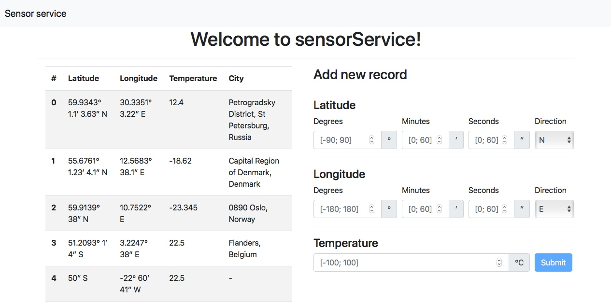

# SensorService

REST API service for accumulating sensory input.  
Keeps only last 10 entries, automatically determines city by coordinates via google map API.  

## How to run

Execute init.sh script in root directory, that will build spring project, launch it and then launch angular.  
REST server opens on 8080 port, angular UI on 4200 port

## Tests

Tests will execute automatically when building project  
Tests themselves could be found in java project in /backend folder

## Validation

Input validates on both sides: on client for more responsive experience, on server for validation on direct requests.

## Direct server usage
Server repository can be found here:  
https://github.com/VladlenKaraush/SensorService

Destination url by default is localhost:8080/records  
To send request directly on server(e.g. from Postman) you should comply with following form:  
{  
  &nbsp;&nbsp;&nbsp;&nbsp;&nbsp;&nbsp;altitude: '(+-) [-180; 180]° [0; 60]′ [0;60]″ (NE)',  
  &nbsp;&nbsp;&nbsp;&nbsp;&nbsp;&nbsp;longitude: '(+-) [-90; 09]° [0; 60]′ [0;60]″ (NE)',  
  &nbsp;&nbsp;&nbsp;&nbsp;&nbsp;&nbsp;temperature: '[-100;100]'  
}  

For example here's valid body:  

{  
  &nbsp;&nbsp;&nbsp;&nbsp;&nbsp;&nbsp;altitude: '59.9343° 1.1′ 3.63″ N',  
  &nbsp;&nbsp;&nbsp;&nbsp;&nbsp;&nbsp;longitude: '-10.3351° 3.22″ ',  
  &nbsp;&nbsp;&nbsp;&nbsp;&nbsp;&nbsp;temperature: '-17'  
}  
You can leave some parts out as long as at least one of them is present  
Floating point values can be used.

## Technologies used:
* Angular 6
* Spring 5
* Spring boot 2
* Bootstrap 4
* Google map API

